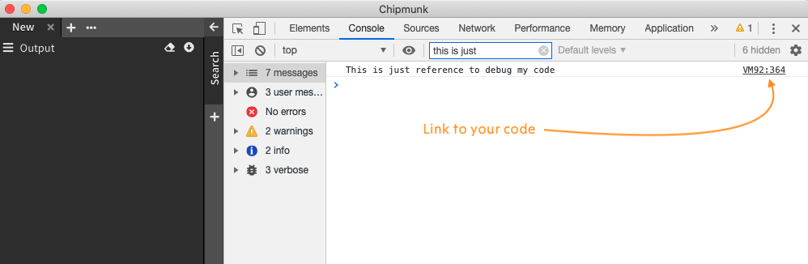

[](LICENSE.txt)
[](https://github.com/esrlabs/chipmunk/actions)
[](https://github.com/esrlabs/chipmunk/actions)

## Chipmunk Log Analyzer & Viewer

`chipmunk` is a fast logfile viewer that can deal with huge logfiles (>10 GB). This repo has examples of plugins for `chipmunk` and will be a good start point for any developer, who would like to create a plugin.

## Quick Start
Even cloning of chipmunk isn't a necessary step and you can use for the testing release version, we would recommend clone chipmunk to use the most updated version of it.

Let's create a folder, which we will use for chipmunk and chipmunk-quickstart
```
mkdir chipmunk-developing
cd chipmunk-developing
```

Clone chipmunk and chipmunk-quickstart
```
git clone https://github.com/esrlabs/chipmunk.git
git clone https://github.com/esrlabs/chipmunk-quickstart.git
cd chipmunk-quickstart
```
Quickstart repo has a few examples of plugins, located in folder `plugin`:
```
└── plugins
    ├── plugin.helloworld
    ├── plugin.row.columns
    ├── plugin.row.parser
    ├── plugin.selection.parser
    └── plugin.sh
```
To build plugin, command `build` should be called with path to target plugin:
```
rake build[./plugins/plugin.helloworld]
```
Optionally you can define a version of your plugin:
```
rake build[./plugins/plugin.helloworld, 1.0.1]
```
>> **Windows Note**
>> To call a rake task with multiple arguments, it could be command should be wrapped as string `rake 'build[./plugins/plugin.helloworld, 1.0.1]'`

Note, very first build always takes some noticeable time, because of build script downloads and compiles necessary infrastructure.

As result folder release will be created with the compiled plugin:
```
├── plugins
│   ├── plugin.helloworld
│   ├── plugin.row.columns
│   ├── plugin.row.parser
│   ├── plugin.selection.parser
│   └── plugin.sh
└── releases
    └── plugin.sh
```
Now we should provide a path to our plugin and start chipmunk. But first of all we should build it.
```
cd ../chipmunk
rake full_pipeline
```
It will build chipmunk. This operation takes some time. But the good news - you should do it only once. After a build was finished, you will be able to start chipmunk from a release folder.

Before you start chipmunk, let's pass some envvars. Let's define a full path to folder with a release of your plugin.

```
export CHIPMUNK_PLUGINS_SANDBOX=../chipmunk-quickstart/releases
```

As default chipmunk stores plugins in `~/.chipmunk/plugins` but with this variable, we can change it.

Also, let's prevent the installation of default plugins
```
export CHIPMUNK_PLUGINS_NO_DEFAULTS=true
```
If you have your plugin already published in chipmunk store, you might be interested to prevent updating of it:
```
export CHIPMUNK_PLUGINS_NO_UPGRADE=true
export CHIPMUNK_PLUGINS_NO_UPDATES=true
```

And very last step before to run, let's enable logs in the  console
```
export CHIPMUNK_DEV_LOGLEVEL=ENV
```
Now you can start chipmunk as well

```
# Good OS (Darwin)
./application/electron/dist/release/mac/chipmunk.app/Contents/MacOS/chipmunk

# Windows
./application/electron/dist/release/win-unpacked/chipmunk.exe

# Human OS (Linux)
./application/electron/dist/release/linux-unpacked/chipmunk
```
Make sure, you have a right path to your plugins. In logs you will see something like it:
```
[1585299134354][    +1ms][  DEBUG][ServicePaths]: Paths:
        home: /Users/noname/.chipmunk
        root: /Users/noname/chipmunk-developing/chipmunk/application/electron/dist/compiled
        app: /Users/noname/chipmunk-developing/chipmunk/application/electron/dist/compiled
        exec /Users/noname/chipmunk-developing/chipmunk/application/electron/dist/compiled
        resources /Users/noname/chipmunk-developing/chipmunk/application/electron/node_modules/electron/dist/Electron.app/Contents/Resources
>>>>    plugins /Users/noname/chipmunk-developing/chipmunk-quickstart/releases
        plugins settings /Users/noname/.chipmunk/plugins.cfg
        included plugins /Users/noname/chipmunk-developing/chipmunk/application/electron/dist/compiled/plugins
        sockets /Users/noname/.chipmunk/sockets
        streams /Users/noname/.chipmunk/streams
        modules /Users/noname/chipmunk-developing/chipmunk/application/electron/node_modules
```
Also if all good you will see initialization of your plugin:
```
[1585299137343][    +3ms][    ENV][ControllerPluginInstalled (/Users/noname/chipmunk-developing/chipmunk-quickstart/releases/plugin.helloworld)]: Plugin state:
        package render:         OK
        package process:        OK
        controller render:      OK
        controller process:     OK
```
It means and render (frontend) and process (backend) were initialized as well.

## Debugging
First of all, we have to activate debug-mode before start chipmunk:
```
export CHIPMUNK_DEVELOPING_MODE=ON
```
Now after chipmunk will be started in logs we will see something like it:
```
[1585337256971][  +146ms][  DEBUG][plugin: plugin.helloworld]: Debugger listening on ws://127.0.0.1:9240/9d87e0bb-8215-4261-8beb-d8527dbe7dc0
For help, see: https://nodejs.org/en/docs/inspector
```
So, now we know a port, which can be used for debugger `:9240`.

All we need to add debug-configuration in VSCode
```
{
    "name": "plugin.helloworld",
    "type": "node",
    "request": "attach",
    "port": 9240,
    "timeout": 60000
}
```
This is how you can debug backend. But the best way to debug front-end will be just add somethere in your code simple console output:
```
/*
 * Public API Surface of terminal
 */

export * from './lib/views/sidebar.vertical/component';
export * from './lib/module';

console.log('This is just reference to debug my code');
```

Start chipmunk and you will see



Now it enough, just click on the ref to get access to your code.

> **Note**. Why `console.log()` but not `debugger`? Because with debugger you will stop each time even you don't need it and it's quite annoying. 

Keep in mind, chipmunk's logs are located in `~/.chipmunk/chipmunk.log` (also there are logs of other chipmunk's modules). All logs except logs type `ENV` are writen there. Chipmunk's logs are include logs of all plugins.

## Chipmunk environment variables

**CHIPMUNK_DEVELOPING_MODE**
`ON` - activate developing mode:
* all plugins processes will be started with debug-listener
* browser will be started with devtools

**CHIPMUNK_DEV_LOGLEVEL**
`INFO` (I, IN),
`DEBUG` (D, DEB),
`WARNING` (W, WAR, WARN),
`VERBOS` (V, VER, VERBOSE),
`ERROR` (E, ERR),
`ENV` - ENV logs never writes into logs file; it's just shown in stdout,
`WTF` - WTF logs useful for debuggin. If at least one WTF log was sent, only WTF logs will be shown. This logs never writes into logs file,

**CHIPMUNK_PLUGINS_SANDBOX**
`string` - path to custom plugins folder

**CHIPMUNK_PLUGINS_NO_DEFAULTS**
`TRUE` (true, ON, on) - prevent downloading of defaults plugins

**CHIPMUNK_PLUGINS_NO_UPGRADE**
`TRUE` (true, ON, on) - prevent upgrade plugins

**CHIPMUNK_PLUGINS_NO_UPDATES**
`TRUE` (true, ON, on) - prevent update plugins workflow

**CHIPMUNK_PLUGINS_NO_REMOVE_NOTVALID**
`TRUE` (true, ON, on) - prevent removing not valid plugins

## Build scripts
Build plugin
```
rake build[path_to_plugin, version, path_to_versions_file]
```
`path_to_plugin` (required) - path to sources of plugin
`version` (optional) - version of the plugin (default 999.999.999 to prevent update of plugin, if plugin was published)
`path_to_versions_file` (optional) - by default build-script will try to download version-file from chipmunk repo. In case if you need to define a specific version of some dependency or you are offline, you can use local version-file (versions.json)

Rebuild plugin
```
rake rebuild[path_to_plugin, version, path_to_versions_file]
```
Difference between `build` and `rebuild` is: `rebuild` always reinstall npm stuff, while `build` doesn't reinstall npm if folder node_modules already exist.

Synch angular sources
```
rake synch[path_to_plugin, path_to_versions_file]
```
This is actual only for angular-plugins. Because sources of the plugin will be copied from `./plugins/plugin.helloworld` into `./chipmunk-angular/projects/helloworld` a developer has to work in angular eco-system (to have working references to modules/libraries). To quickly copy sources from angular to sources back, command `synch` could be used.

## Recommended way of developing
```
# Clone chipmunk quickstart
git clone https://github.com/esrlabs/chipmunk-quickstart.git
cd chipmunk-quickstart

# Select plugin, which could be used as a template and copy it
cp -r ./plugins/plugin.helloworld ./plugins/plugin.myplugin

#Rename plugin in all package.json files (in process folder and render)

#Ref plugin with github repo
cd ./plugins/plugin.myplugin
git init
git remote add url_to_plugin_repo
```
This is not one way of developing. You can store sources of your plugin anywhere and provide the correct path to in with build command. But this way is good for plugins with angular part because quickstart creates angular eco-system for it.